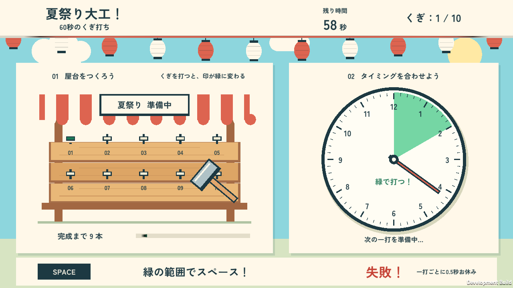

# 夏祭り大工！60秒のくぎ打ち

時計の針にタイミングを合わせて、夏祭りの屋台を完成させよう！

「夏」「大工の世界」「時計」をテーマにした、1人用の2Dタイミングゲームです。
新人の大工になって、60秒以内に10本のくぎを打つことを目指します。学生課題を想定し、1シーンと少数のスクリプトで構成。

| 項目 | 内容 |
| --- | --- |
| ジャンル | 2Dタイミングゲーム |
| プレイ人数 | 1人 |
| 表示言語 | 日本語 |
| 対象環境 | PCブラウザー（WebGL）／Windows |
| 操作 | キーボード・マウス |
| 基準解像度 | 1920 × 1080（16：9） |
| 制作環境 | Unity 6.3／C# |

## 遊び方

1. 「スタート」をクリックします。
2. 時計の針が緑の範囲に入った瞬間に、**スペースキー**を押します。
3. 成功すると、くぎが1本増えます。失敗しても本数は減りません。
4. 残り時間があるうちに10本成功すると、屋台が完成してゲームクリアです。
5. 時間切れになるとゲームオーバー。「もう一度」で再挑戦できます。

| 操作 | 入力 |
| --- | --- |
| 開始・リトライ | 画面のボタンをマウスでクリック |
| くぎを打つ | スペースキーを押す |

時計の針は、時計回りに**2秒で1周**します。緑の範囲は幅60度で、初回は12時から2時の位置にあり、一周するごとに位置がランダムに変わります。

成功・失敗のどちらも、判定後**0.5秒間**は次のくぎを打てません。その間も針と制限時間は進みます。スペースキーを押し続けても判定は繰り返されません。終了後は針・時間・入力判定が停止します。

## 主な構成

ゲーム用のファイルは `Assets/SummerFestival` にまとめています。通常のゲーム処理に使う自作ランタイムスクリプトは2つです。

| ファイル | 役割 |
| --- | --- |
| [Scenes/SummerFestival.unity](Assets/SummerFestival/Scenes/SummerFestival.unity) | タイトル・プレイ・結果画面を含むゲームシーン |
| [Scripts/FestivalGame.cs](Assets/SummerFestival/Scripts/FestivalGame.cs) | 状態管理、入力判定、時間、成功本数、画面更新、リトライ、ハンマーと効果音 |
| [Scripts/FestivalShape.cs](Assets/SummerFestival/Scripts/FestivalShape.cs) | Canvas上の円形時計と成功範囲の扇形を描画 |

ゲームの状態は `BeforeStart`（開始前）
、`Playing`（プレイ中）、`Clear`（クリア）、`GameOver`（時間切れ）の4つです。
時間更新には `Time.deltaTime`、スペース入力には `wasPressedThisFrame` を使用しています。時間切れの判定を入力より先に行います。

背景や屋台は個別のUI図形で構成しています。ハンマーの短いアニメーション、成功・失敗の効果音、クリア時の屋台完成表示も実装しています。

## 日本語フォント

日本語には **Zen Kaku Gothic New Bold** を使用し、静的なTMPフォントアトラスを同梱しています。

表示する文章や漢字を追加するときは、TMP Font Asset Creatorで `FestivalJapanese` の収録文字を更新してください。元フォントは `Assets/SummerFestival/Fonts/ZenKakuGothicNew-Bold.ttf` です。既存の文字を残して必要な文字を加え、アトラスを再生成・保存します。スクリプト内の文章を書き換えるだけでは、フォントの収録文字は増えません。

## クレジット・ライセンス

- 日本語フォント：Zen Kaku Gothic New／The Zen Kaku Gothic Project Authors。**SIL Open Font License 1.1**。同梱の [OFL.txt](Assets/SummerFestival/Fonts/OFL.txt) を参照してください。
- 画面の図形と短い効果音は、プロジェクト内で作成しています。
- 依存パッケージには、それぞれのライセンスが適用されます。
